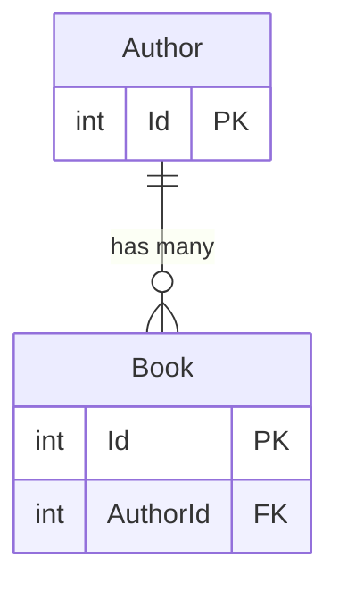
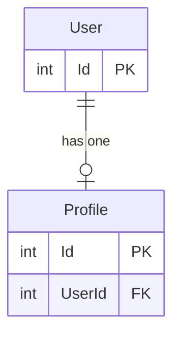
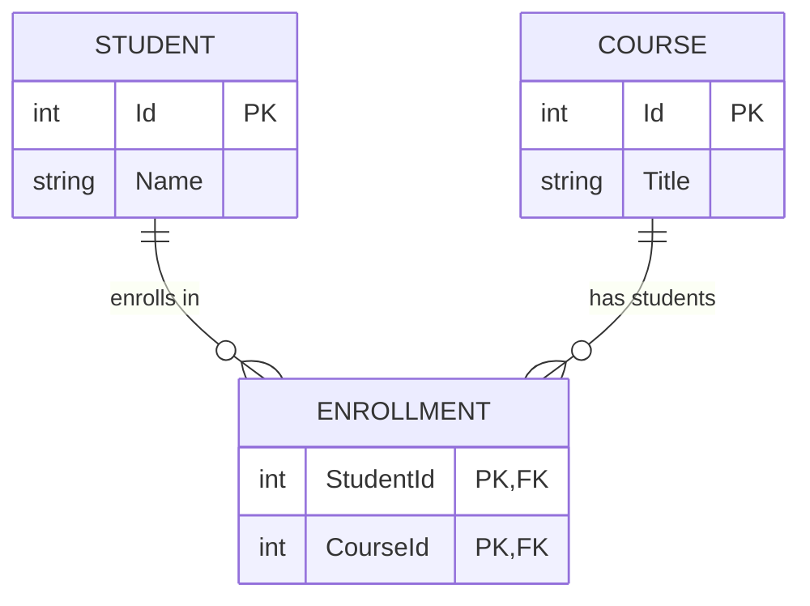

# Read Me

## DesignTime Integration

This package can generate GraphQL DataLoaders (and related extensions) at **EF Core design-time** when you scaffold migrations. This is done by registering a custom `IMigrationsCodeGenerator`.

### 1) Add the design-time package

Reference `Stackworx.EfCoreGraphQL.DesignTime` from the project EF tooling loads at design-time (commonly your **startup** project, but any project EF loads for design-time services works).

> Note: EF tooling loads design-time services from the *startup project* and the design-time assembly references it discovers.

### 2) Register `EfCoreMigrationsCodeGenerator`

Create a class that implements `IDesignTimeServices` (EF Core tooling discovers it automatically) and register the code generator:

```csharp
using Microsoft.EntityFrameworkCore.Design;
using Microsoft.EntityFrameworkCore.Migrations.Design;
using Microsoft.Extensions.DependencyInjection;
using Stackworx.EfCoreGraphQL.DesignTime;

public sealed class DesignTimeServices : IDesignTimeServices
{
    public void ConfigureDesignTimeServices(IServiceCollection services)
        => services.AddSingleton<IMigrationsCodeGenerator, EfCoreMigrationsCodeGenerator>();
}
```

Example: see `sample/Sample.DesignTime/DesignTimeServices.cs`.

### 3) Configure the output directory (required)

During migration scaffolding EF Core may run with a working directory that **is not** your migrations/target project directory (especially when `--startup-project` differs from the target project). To avoid writing generated files to the wrong place, sidecar output requires an explicit directory.

Set this environment variable before running `dotnet ef`:

- `STACKWORX_EFCOREGRAPHQL_SIDECAR_OUTPUT_DIR`

It must point to an **existing directory**. A typical value is your migrations folder.

macOS / Linux (zsh/bash):

```zsh
export STACKWORX_EFCOREGRAPHQL_SIDECAR_OUTPUT_DIR="/absolute/path/to/YourProject/Migrations"
```

Windows (PowerShell):

```powershell
$env:STACKWORX_EFCOREGRAPHQL_SIDECAR_OUTPUT_DIR = "C:\\path\\to\\YourProject\\Migrations"
```

If this variable is not set (or points to a non-existent directory), migration scaffolding will fail with a clear error.

### 4) Scaffold a migration

Run EF migrations as usual. The generator runs when EF scaffolds/updates the *model snapshot*.

```zsh
dotnet ef migrations add InitialCreate \
  --project ./src/Your.Migrations.Project \
  --startup-project ./src/Your.Api.Project
```

### Generated files

Sidecar files are written into `STACKWORX_EFCOREGRAPHQL_SIDECAR_OUTPUT_DIR` with names based on the model snapshot name:

- `{ModelSnapshotName}.DataLoaders.g.cs`
- `{ModelSnapshotName}.DataLoaders.g.hash`

The `.hash` file prevents unnecessary regeneration when the snapshot hasn’t changed.

## Goal

Auto generate dataloaders and extensions to match EF core navigations.

## Scenarios

### Generic Data Loader

All entities can be batched loaded directly by primary key

```csharp
// Generic Data Loader
[DataLoader]
internal static async Task<Dictionary<int, Author>> AuthorByIdDataLoader(
    IReadOnlyList<int> ids,
    IDbContextFactory<AppDbContext> factory,
    CancellationToken cancellationToken)
{
    await using var dbContext = await factory.CreateDbContextAsync(cancellationToken);

    var authors = await dbContext.Set<Author>()
        .Where(a => ids.Contains(a.Id))
        .ToListAsync(cancellationToken);

    return authors.ToDictionary(a => a.Id);
}
```

### One to Many



```csharp
public class Author
{
    public int Id { get; set; }
    ...
    public IList<Book> Books { get; set; } = [];
}

public class Book
{
    public int Id { get; set; }
    
    // Cannot generate reverse dataloader without FK
    public int AuthorId { get; set; }
    public Author Author { get; set; }
}

// Author -> Books
[DataLoader]
internal static async Task<ILookup<int, Book>> BooksByAuthorId(
    IReadOnlyList<int> authorIds,
    IDbContextFactory<AppDbContext> factory,
    CancellationToken cancellationToken)
{
    await using var dbContext = await factory.CreateDbContextAsync(cancellationToken);

    var books = await dbContext.Set<Book>()
        .Where(b => authorIds.Contains(b.AuthorId))
        .ToListAsync(cancellationToken);

    return books.ToLookup(b => b.AuthorId);
}

[ExtendObjectType(typeof(Book))]
public sealed class BookExtensions
{
    public async Task<Author> GetAuthorAsync(
        [Parent] Book parent,
        IAuthorByIdDataLoader dataLoader,
        CancellationToken ct)
    {
        // Foreign Key Required Here
        return await dataLoader.LoadAsync(parent.AuthorId, ct);
    }
}

[ExtendObjectType(typeof(Author))]
public sealed class UserExtensions
{
    public async Task<IEnumerable<Book>> GetBooksAsync(
        [Parent] Author parent,
        IBooksByAuthorIdDataLoader dataLoader,
        CancellationToken ct)
    {
        return await dataLoader.LoadAsync(parent.Id, ct);
    }
}
```

### One to One

the only difference between one to one and one to many is that we return a Dictionary instead of a Lookup
as each key can only map to a single entity



```csharp
public class User
{
    public int Id { get; set; }
    ...
    public Profile Profile { get; set; } = default!;
}

public class Profile
{
    public int Id { get; set; }
    ...
    public int UserId { get; set; }
    public User User { get; set; } = default!;
}

[DataLoader]
internal static async Task<Dictionary<int, Profile>> ProfileByUserId(
    IReadOnlyList<int> userIds,
    IDbContextFactory<AppDbContext> factory,
    CancellationToken cancellationToken)
{
    await using var dbContext = await factory.CreateDbContextAsync(cancellationToken);

    var profiles = await dbContext.Profiles
        .Where(p => userIds.Contains(p.UserId))
        .ToListAsync(cancellationToken);

    return profiles.ToDictionary(p => p.UserId);
}

[ExtendObjectType(typeof(User))]
public sealed class UserExtensions
{
    public async Task<IEnumerable<Student>> GetProfileAsync(
        [Parent] User parent,
        IProfileByUserIdDataLoader dataLoader,
        CancellationToken ct)
    {
        return await dataLoader.LoadAsync(parent.Id, ct);
    }
}

// Reuses global data loader
[ExtendObjectType(typeof(Profile))]
public sealed class ProfileExtensions
{
    public async Task<User> GetUserAsync(
        [Parent] Profile parent,
        IUserByIdDataLoader dataLoader,
        CancellationToken ct)
    {
        return await dataLoader.LoadAsync(parent.UserId, ct);
    }
}
```

### Many to Many



```csharp
public class Student
{
    public int Id { get; set; }
    ...
    public ICollection<Enrollment> Enrollments { get; set; } = new List<Enrollment>();
}

public class Course
{
    public int Id { get; set; }
    ...
    public ICollection<Enrollment> Enrollments { get; set; } = new List<Enrollment>();
}

// Join entity (many-to-many)
public class Enrollment
{
    public int StudentId { get; set; }
    public Student Student { get; set; } = default!;
    public int CourseId { get; set; }
    public Course Course { get; set; } = default!;
}

[DataLoader]
internal static async Task<ILookup<int, Course>> CoursesByStudentIdDataLoader(
    IReadOnlyList<int> studentIds,
    IDbContextFactory<AppDbContext> factory,
    CancellationToken cancellationToken)
{
    await using var dbContext = await factory.CreateDbContextAsync(cancellationToken);

    var enrollments = await dbContext.Enrollments
        .Where(e => studentIds.Contains(e.StudentId))
        .Include(e => e.Course)
        .ToListAsync(cancellationToken);

    // Group all enrolled courses by student id
    return enrollments.ToLookup(e => e.StudentId, e => e.Course);
}

[DataLoader]
internal static async Task<ILookup<int, Student>> StudentsByCourseIdDataLoader(
    IReadOnlyList<int> courseIds,
    IDbContextFactory<AppDbContext> factory,
    CancellationToken cancellationToken)
{
    await using var dbContext = await factory.CreateDbContextAsync(cancellationToken);

    var enrollments = await dbContext.Enrollments
        .Where(e => courseIds.Contains(e.CourseId))
        .Include(e => e.Student)
        .ToListAsync(cancellationToken);

    // Group all students by course id
    return enrollments.ToLookup(e => e.CourseId, e => e.Student);
}

[ExtendObjectType(typeof(Student))]
public sealed class StudentExtensions
{
    public async Task<IEnumerable<Course>> GetCoursesAsync(
        [Parent] Student student,
        ICoursesByStudentIdDataLoader dataLoader,
        CancellationToken cancellationToken)
    {
        return await dataLoader.LoadAsync(student.Id, cancellationToken);
    }
}
```
