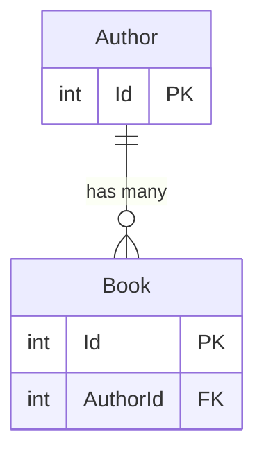
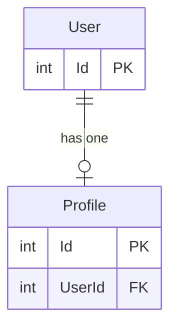
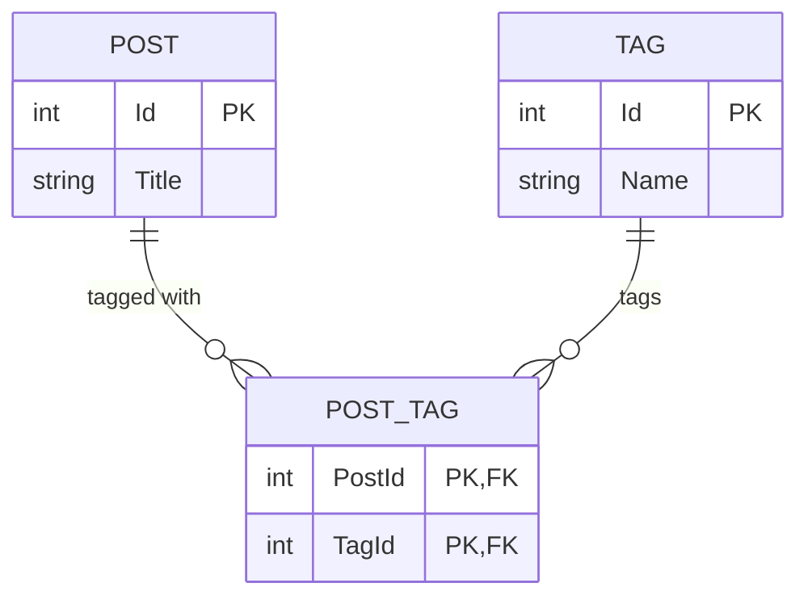

# Read Me

## DesignTime Integration

This package can generate GraphQL DataLoaders (and related extensions) at **EF Core design-time** when you scaffold migrations. This is done by registering a custom `IMigrationsCodeGenerator`.

### 1) Add the design-time package

Reference `Stackworx.EfCoreGraphQL.DesignTime` from the project EF tooling loads at design-time (commonly your **startup** project, but any project EF loads for design-time services works).

> Note: EF tooling loads design-time services from the *startup project* and the design-time assembly references it discovers.

### 2) Register `EfCoreMigrationsCodeGenerator`

Create a class that implements `IDesignTimeServices` (EF Core tooling discovers it automatically) and register the code generator:

```csharp
using Microsoft.EntityFrameworkCore.Design;
using Microsoft.Extensions.DependencyInjection;
using Stackworx.EfCoreGraphQL.DesignTime;

public sealed class DesignTimeServices : IDesignTimeServices
{
    public void ConfigureDesignTimeServices(IServiceCollection services)
        => services.AddEfCoreGraphQL();
}
```

Example: see `sample/Sample.DesignTime/DesignTimeServices.cs`.

### 3) Configure generation (optional)

`AddEfCoreGraphQL` also takes a `GenerateOptions`, or an `Action<GenerateOptions>`, so the design-time
route supports the same [options](#options) as the runtime one:

The three symbols live in three different namespaces:

```csharp
using Microsoft.Extensions.DependencyInjection;    // IServiceCollection
using Stackworx.EfCoreGraphQL;                     // EntityTypeFilters, GenerateOptions
using Stackworx.EfCoreGraphQL.Abstractions;        // Mode
using Stackworx.EfCoreGraphQL.DesignTime;          // AddEfCoreGraphQL

public void ConfigureDesignTimeServices(IServiceCollection services)
    => services.AddEfCoreGraphQL(options =>
    {
        options.Mode = Mode.OptIn;
        options.Filter = EntityTypeFilters.AspNetIdentity;
        options.IgnoreForeignKeyFields = false;
    });
```

Left unset, `Namespace` is derived from the model snapshot's namespace
(`{modelSnapshotNamespace}.Generated.DataLoaders`).

### 4) Configure the output directory (required)

During migration scaffolding EF Core may run with a working directory that **is not** your migrations/target project directory (especially when `--startup-project` differs from the target project). To avoid writing generated files to the wrong place, sidecar output requires an explicit directory.

Set this environment variable before running `dotnet ef`:

- `STACKWORX_EFCOREGRAPHQL_SIDECAR_OUTPUT_DIR`

It must point to an **existing directory**. A typical value is your migrations folder.

macOS / Linux (zsh/bash):

```zsh
export STACKWORX_EFCOREGRAPHQL_SIDECAR_OUTPUT_DIR="/absolute/path/to/YourProject/Migrations"
```

Windows (PowerShell):

```powershell
$env:STACKWORX_EFCOREGRAPHQL_SIDECAR_OUTPUT_DIR = "C:\\path\\to\\YourProject\\Migrations"
```

If this variable is not set (or points to a non-existent directory), migration scaffolding will fail with a clear error.

### 5) Scaffold a migration

Run EF migrations as usual. The generator runs when EF scaffolds/updates the *model snapshot*.

```zsh
dotnet ef migrations add InitialCreate \
  --project ./src/Your.Migrations.Project \
  --startup-project ./src/Your.Api.Project
```

### 6) Regenerate without a migration

Generation reads things the EF model snapshot does not record — `[EFCoreGraphQLInclude]`, `[GraphQLIgnore]`,
`GenerateOptions` — so output can go stale while the snapshot is current. Scaffolding a migration to pick
those up leaves an empty `Up`/`Down` pair in the migration history, which is not a change anyone wants to
review. `SidecarGenerator` regenerates without one:

```csharp
using Stackworx.EfCoreGraphQL.DesignTime;

if (args.Contains("--generate-dataloaders"))
{
    foreach (var result in SidecarGenerator.Generate(typeof(Program).Assembly))
    {
        Console.WriteLine($"{(result.Changed ? "updated" : "unchanged")} {result.Path}");
    }

    return;
}
```

```zsh
dotnet run --project ./src/Your.Api.Project -- --generate-dataloaders
```

It scans the assembly for what EF tooling would have handed it, so there is nothing to configure twice:

| Discovered                             | Used for                                                    |
|----------------------------------------|-------------------------------------------------------------|
| `ModelSnapshot` + its `[DbContext]`    | Output file name, derived namespace, and the context type.  |
| `IDesignTimeDbContextFactory<TContext>`| Building the EF model. Required — a snapshot records no CLR types, so the model has to come from a live context. |
| `IDesignTimeServices`                  | The `GenerateOptions` your `AddEfCoreGraphQL` call registers. |

Output goes to `STACKWORX_EFCOREGRAPHQL_SIDECAR_OUTPUT_DIR`, or to the directory you pass as the second
argument. Both routes write the same bytes to the same path, so moving between them never churns the file.

`Changed` says whether generation altered the file, which is the up-to-date check for CI — as a test:

```csharp
SidecarGenerator.Generate(typeof(Program).Assembly, MigrationsDirectory)
    .Should().OnlyContain(r => !r.Changed);
```

Two things to know:

- Use this for changes the EF model does not see. When the model itself changes you are scaffolding a
  migration anyway, and the snapshot hook keeps output fresh there.
- Running from your own app means the app has to compile, and the sidecar is part of that compilation. Editing
  or refreshing it is fine; deleting it is not, because the HotChocolate analyzer's registrations go with it.
  Restore it with `git checkout` (or scaffold a migration) rather than regenerating from nothing.

### Generated files

Sidecar files are written into `STACKWORX_EFCOREGRAPHQL_SIDECAR_OUTPUT_DIR` with names based on the model snapshot name:

- `{ModelSnapshotName}.DataLoaders.g.cs`

The sidecar is regenerated when EF scaffolds/updates the model snapshot to avoid stale output when generation-affecting changes don’t influence the EF snapshot text.

More detail: [`Stackworx.EfCoreGraphQL.DesignTime`](src/Stackworx.EFCoreGraphQL.DesignTime/README.md).

## Standalone Generation

Generation can also be driven from your own code (a console project, a test) against a live `DbContext`,
which is the route to take when you don't scaffold migrations:

```csharp
var options = new GenerateOptions
{
    Namespace = "Api.Generated.DataLoaders",
    CI = args.Contains("--ci"),
};

await DataLoaderGenerator.Generate(dbContext, "./Types/DataLoaders.g.cs", options);
```

Example: see `sample/Sample.Generate/Program.cs`.

## Options

`GenerateOptions` is shared by both routes.

| Option                   | Default             | Effect                                                                                                                      |
|--------------------------|---------------------|-----------------------------------------------------------------------------------------------------------------------------|
| `Mode`                   | `Mode.OptOut`       | `OptOut` generates for every entity except those marked `[EFCoreGraphQLIgnore]`; `OptIn` only for `[EFCoreGraphQLInclude]`.  |
| `Filter`                 | none                | `Func<IEntityType, bool>`; return true to exclude an entity. For types you cannot annotate.                                  |
| `Namespace`              | `Generated.DataLoaders` | Namespace of the generated code. The design-time route instead derives it from the model snapshot's namespace.           |
| `IgnoreForeignKeyFields` | `true`              | Hides foreign-key scalar fields via `ExtendObjectType(IgnoreFields = ...)` because the navigation replaces them.             |
| `CI`                     | `false`             | Fails the process when generated output differs from git HEAD. Standalone generation only; ignored during scaffolding.        |

### Gradual adoption

`Mode.OptIn` generates nothing until a type is marked, so an existing schema can be migrated one entity at
a time:

```csharp
[EFCoreGraphQLInclude]
public class Author { /* ... */ }
```

Pair it with `IgnoreForeignKeyFields = false` on an existing schema: hiding a foreign-key scalar removes a
field clients may already select (e.g. a foreign key that doubles as a business identifier).

#### A pre-existing `IgnoreFields` can silently delete a generated field

This is the trap when adopting into a schema that already hides fields by hand, and it produces a *zero-line*
schema diff, so it is easy to mistake for "nothing to generate".

HotChocolate applies `ExtendObjectType(IgnoreFields = [...])` while it merges *that* extension into the type,
against the fields present at that moment — and a later extension re-adds whatever it resolves. Two extension
classes on one entity therefore mean **the one that merges last wins, and merge order is registration order**:

```csharp
// hand-written, ...Hub.GraphQL.Types
[ExtendObjectType<ApplicationUser>(IgnoreFields = ["passwordHash", "party"])]
public static class ApplicationUserExtensions;

// generated, ...Hub.GraphQL.Generated
[ExtendObjectType<ApplicationUser>]
public static class ApplicationUserExtensions
{
    public static async Task<Party> GetPartyAsync(
        [Parent] ApplicationUser parent, IPartyByIdDataLoader loader, CancellationToken ct)
        => await loader.LoadAsync(parent.PartyId, ct);
}
```

Register the generated extension first and `party` never reaches the SDL: it compiles, it registers, and the
resolver is dead code. Register it last and `party` is there. Nothing warns either way.

The generator cannot see this — the ignore lives in another namespace, is not in the EF model, and whether it
wins is decided at registration time — so **detection belongs at schema build**. `Stackworx.EfCoreGraphQL.Validation`
reports it as `ErrorKind.SuppressedField`; see [validating the schema](#validating-the-schema).

The fix is to hide the navigation where the generator can see it, which also stops the dead code being
emitted:

```csharp
[GraphQLIgnore]
public Party Party { get; set; } = null!;
```

`IgnoreForeignKeyFields = true` puts the generator on the other side of the same collision: it emits its own
`IgnoreFields` for foreign-key scalars, which a hand-written extension can then re-add. Foreign-key scalars
are fields of the base type rather than of an extension, so no extension re-adds them and order does not
change the outcome — but the same reasoning applies to anything an extension contributes.

### Validating the schema

`Stackworx.EfCoreGraphQL.Validation` compares the built schema against the EF model and reports two things:

| `ErrorKind`       | Meaning                                                                        |
|-------------------|--------------------------------------------------------------------------------|
| `MissingResolver` | The navigation is a field, but resolves by property access — a query per parent. |
| `SuppressedField` | A resolver was generated for the navigation, and the schema has no field for it. |

Pass the same `Mode` and `Filter` generation ran with. They scope validation to the entities generation
covers, so entities nothing was generated for are not reported:

```csharp
var errors = EvaluateSchema.Evaluate(
    schema,
    model,
    Mode.OptIn,
    e => e.ClrType.Namespace == "Microsoft.AspNetCore.Identity");
```

With `Stackworx.EfCoreGraphQL.Validation.XunitV3` the same check is a test:

```csharp
schema.ValidateDbContext(model, Mode.OptIn, EntityTypeFilters.AspNetIdentity);
```

`EntityTypeFilters` lives in `Stackworx.EfCoreGraphQL`, so reference that package too when you want the
built-in filter rather than your own lambda — or share one `Func<IEntityType, bool>` between your
`IDesignTimeServices` and your test, which is what keeps the two from drifting.

### Types you cannot annotate

`[EFCoreGraphQLIgnore]` needs the type's source, which rules out framework entities. `Filter` covers those,
and `EntityTypeFilters.AspNetIdentity` is built in for the common case:

```csharp
options.Filter = EntityTypeFilters.AspNetIdentity;

// or combined with your own exclusions
options.Filter = e => EntityTypeFilters.AspNetIdentity(e) || e.ClrType == typeof(AuditEntry);
```

It matches only types declared in `Microsoft.AspNetCore.Identity`, so your own `ApplicationUser :
IdentityUser<Guid>` is kept — annotate that one if you want it out.

## Goal

Auto generate dataloaders and extensions to match EF core navigations.

## Scenarios

Generated code is shown with short type names for readability; the generator emits fully-qualified ones.
Every loader and field override for an entity lands in one `static class {Entity}Extensions`.

### Generic Data Loader

All entities can be batched loaded directly by primary key

```csharp
[ExtendObjectType<Author>]
public static class AuthorExtensions
{
    [DataLoader]
    public static async Task<IDictionary<int, Author>> AuthorById(
        IReadOnlyList<int> keys,
        AppDbContext context,
        CancellationToken ct)
    {
        return await context.Set<Author>()
            .AsNoTracking()
            .Where(e => keys.Contains(e.Id))
            .ToDictionaryAsync(e => e.Id, ct);
    }
}
```

### One to Many



```csharp
public class Author
{
    public int Id { get; set; }
    ...
    public IList<Book> Books { get; set; } = [];
}

public class Book
{
    public int Id { get; set; }
    
    // Cannot generate reverse dataloader without FK
    public int AuthorId { get; set; }
    public Author Author { get; set; }
}

[ExtendObjectType<Author>]
public static class AuthorExtensions
{
    // Author -> Books
    [DataLoader]
    public static async Task<ILookup<int, Book>> BooksByAuthorId(
        IReadOnlyList<int> keys,
        AppDbContext context,
        CancellationToken ct)
    {
        var items = await context.Set<Book>()
            .AsNoTracking()
            .Where(e => keys.Contains(e.AuthorId))
            .ToListAsync(ct);

        return items.ToLookup(e => e.AuthorId);
    }

    public static async Task<IList<Book>> GetBooksAsync(
        [Parent] Author parent,
        IBooksByAuthorIdDataLoader loader,
        CancellationToken ct)
    {
        return await loader.LoadAsync(parent.Id, ct);
    }
}

// authorId is hidden because the author field replaces it — see IgnoreForeignKeyFields
[ExtendObjectType<Book>(IgnoreFields = ["authorId"])]
public static class BookExtensions
{
    // Reuses the primary key loader on Author
    public static async Task<Author> GetAuthorAsync(
        [Parent] Book parent,
        IAuthorByIdDataLoader loader,
        CancellationToken ct)
    {
        // Foreign Key Required Here
        return await loader.LoadAsync(parent.AuthorId, ct);
    }
}
```

### One to One

the only difference between one to one and one to many is that we return a Dictionary instead of a Lookup
as each key can only map to a single entity



```csharp
public class User
{
    public int Id { get; set; }
    ...
    public Profile Profile { get; set; } = default!;
}

public class Profile
{
    public int Id { get; set; }
    ...
    public int UserId { get; set; }
    public User User { get; set; } = default!;
}

[ExtendObjectType<User>]
public static class UserExtensions
{
    [DataLoader]
    public static async Task<IDictionary<int, Profile>> ProfileByUserId(
        IReadOnlyList<int> keys,
        AppDbContext context,
        CancellationToken ct)
    {
        return await context.Set<Profile>()
            .AsNoTracking()
            .Where(e => keys.Contains(e.UserId))
            .ToDictionaryAsync(e => e.UserId, ct);
    }

    public static async Task<Profile> GetProfileAsync(
        [Parent] User parent,
        IProfileByUserIdDataLoader loader,
        CancellationToken ct)
    {
        return await loader.LoadAsync(parent.Id, ct);
    }
}

[ExtendObjectType<Profile>(IgnoreFields = ["userId"])]
public static class ProfileExtensions
{
    // Reuses global data loader
    public static async Task<User> GetUserAsync(
        [Parent] Profile parent,
        IUserByIdDataLoader loader,
        CancellationToken ct)
    {
        return await loader.LoadAsync(parent.UserId, ct);
    }
}
```

### Many to Many

Generated from EF Core skip navigations, so both sides need a navigation to the other.



```csharp
public class Post
{
    public int Id { get; set; }
    ...
    public ICollection<Tag> Tags { get; set; } = [];
}

public class Tag
{
    public int Id { get; set; }
    ...
    public ICollection<Post> Posts { get; set; } = [];
}

[ExtendObjectType<Post>]
public static class PostExtensions
{
    [DataLoader]
    public static async Task<ILookup<int, Tag>> TagsByPosts(
        IReadOnlyList<int> keys,
        AppDbContext context,
        CancellationToken ct)
    {
        var pairs = await context.Set<Tag>()
            .Where(e => e.Posts.Any(p => keys.Contains(p.Id)))
            .SelectMany(child => child.Posts.Select(parent => new { parent.Id, Child = child }))
            .AsNoTracking()
            .ToListAsync(ct);

        return pairs.ToLookup(e => e.Id, x => x.Child);
    }

    public static async Task<Tag[]> GetTagsAsync(
        [Parent] Post parent,
        ITagsByPostsDataLoader loader,
        CancellationToken ct)
    {
        return await loader.LoadAsync(parent.Id, ct);
    }
}
```

A join entity you declare yourself (`Enrollment` with a `Grade`, say) is not a skip navigation: it is two
one-to-many relationships, and generates as such. The join entity itself is skipped because its primary key
is composite.

### Generic entity types

A generic entity keeps its type arguments wherever the type is *named*, and takes an identifier-safe form
wherever a name is *declared*. `Revision<Book>` becomes:

```csharp
[ExtendObjectType<Revision<Book>>(IgnoreFields = ["bookId"])]
public static class RevisionOfBookExtensions
{
    [DataLoader]
    public static async Task<IDictionary<int, Revision<Book>>> RevisionOfBookById( /* ... */ )
```

so the loader interface is `IRevisionOfBookByIdDataLoader`. ASP.NET Core Identity is the usual source of
these — `IdentityUserClaim<string>` generates as `IdentityUserClaimOfStringExtensions`.
