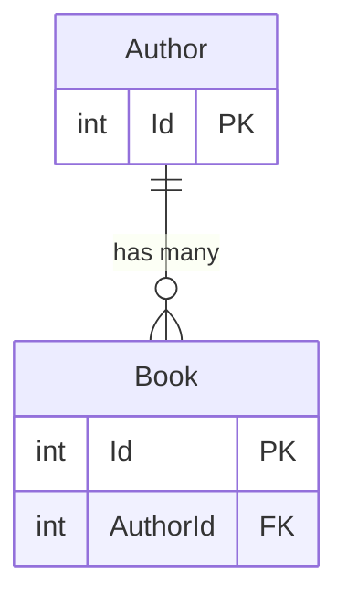
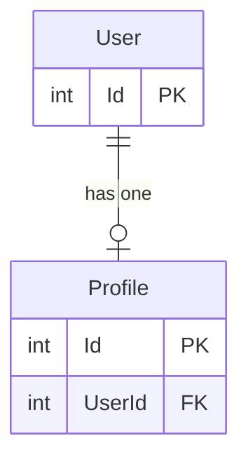
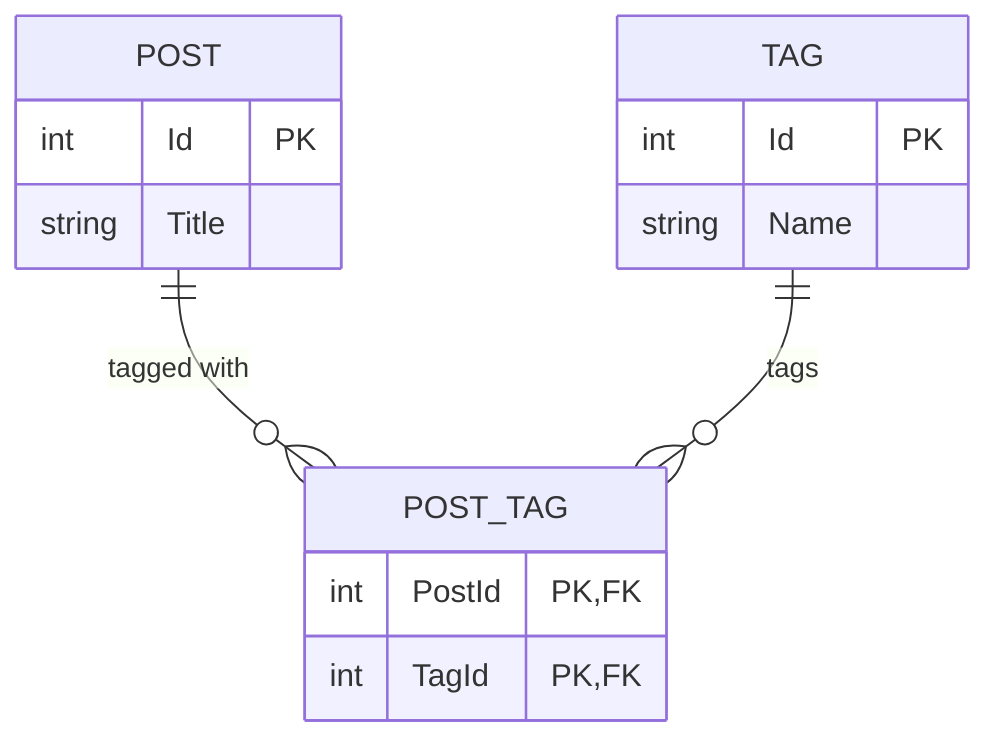

# Stackworx.EfCoreGraphQL

[](https://github.com/stackworx-dotnet/Stackworx.EfCoreGraphQL/actions/workflows/dotnet.yml)
[](https://www.nuget.org/packages/Stackworx.EfCoreGraphQL)
[](https://www.nuget.org/packages/Stackworx.EfCoreGraphQL.DesignTime)
[](https://www.nuget.org/packages/Stackworx.EfCoreGraphQL.Validation)
[](LICENSE)


## DesignTime Integration

This package can generate GraphQL DataLoaders (and related extensions) at **EF Core design-time** when you scaffold migrations. This is done by registering a custom `IMigrationsCodeGenerator`.

### 1) Add the design-time package

Reference `Stackworx.EfCoreGraphQL.DesignTime` from the project EF tooling loads at design-time (commonly your **startup** project, but any project EF loads for design-time services works).

> Note: EF tooling loads design-time services from the *startup project* and the design-time assembly references it discovers.

### 2) Register `EfCoreMigrationsCodeGenerator`

Create a class that implements `IDesignTimeServices` (EF Core tooling discovers it automatically) and register the code generator:

```csharp
using Microsoft.EntityFrameworkCore.Design;
using Microsoft.Extensions.DependencyInjection;
using Stackworx.EfCoreGraphQL.DesignTime;

public sealed class DesignTimeServices : IDesignTimeServices
{
    public void ConfigureDesignTimeServices(IServiceCollection services)
        => services.AddEfCoreGraphQL();
}
```

Example: see `sample/Sample.DesignTime/DesignTimeServices.cs`.

### 3) Configure generation (optional)

`AddEfCoreGraphQL` also takes a `GenerateOptions`, or an `Action<GenerateOptions>`, so the design-time
route supports the same [options](#options) as the runtime one:

```csharp
using Stackworx.EfCoreGraphQL;
using Stackworx.EfCoreGraphQL.Abstractions;

public void ConfigureDesignTimeServices(IServiceCollection services)
    => services.AddEfCoreGraphQL(options =>
    {
        options.Mode = Mode.OptIn;
        options.Filter = EntityTypeFilters.AspNetIdentity;
        options.IgnoreForeignKeyFields = false;
    });
```

Left unset, `Namespace` is derived from the model snapshot's namespace
(`{modelSnapshotNamespace}.Generated.DataLoaders`).

### 4) Configure the output directory (required)

During migration scaffolding EF Core may run with a working directory that **is not** your migrations/target project directory (especially when `--startup-project` differs from the target project). To avoid writing generated files to the wrong place, sidecar output requires an explicit directory.

Set this environment variable before running `dotnet ef`:

- `STACKWORX_EFCOREGRAPHQL_SIDECAR_OUTPUT_DIR`

It must point to an **existing directory**. A typical value is your migrations folder.

macOS / Linux (zsh/bash):

```zsh
export STACKWORX_EFCOREGRAPHQL_SIDECAR_OUTPUT_DIR="/absolute/path/to/YourProject/Migrations"
```

Windows (PowerShell):

```powershell
$env:STACKWORX_EFCOREGRAPHQL_SIDECAR_OUTPUT_DIR = "C:\\path\\to\\YourProject\\Migrations"
```

If this variable is not set (or points to a non-existent directory), migration scaffolding will fail with a clear error.

### 5) Scaffold a migration

Run EF migrations as usual. The generator runs when EF scaffolds/updates the *model snapshot*.

```zsh
dotnet ef migrations add InitialCreate \
  --project ./src/Your.Migrations.Project \
  --startup-project ./src/Your.Api.Project
```

### Generated files

Sidecar files are written into `STACKWORX_EFCOREGRAPHQL_SIDECAR_OUTPUT_DIR` with names based on the model snapshot name:

- `{ModelSnapshotName}.DataLoaders.g.cs`

The sidecar is regenerated when EF scaffolds/updates the model snapshot to avoid stale output when generation-affecting changes don’t influence the EF snapshot text.

One case is deliberately left out. `dotnet ef migrations remove` reverts the snapshot by rebuilding it from
the previous migration's `BuildTargetModel`, whose model declares entity types by name and so carries no CLR
types — there is nothing to generate DataLoaders from. The sidecar is left as it was and `dotnet ef` reports
that it is stale; the next `migrations add` brings it back in sync.

More detail: [`Stackworx.EfCoreGraphQL.DesignTime`](src/Stackworx.EFCoreGraphQL.DesignTime/README.md).

## Standalone Generation

Generation can also be driven from your own code (a console project, a test) against a live `DbContext`,
which is the route to take when you don't scaffold migrations:

```csharp
var options = new GenerateOptions
{
    Namespace = "Api.Generated.DataLoaders",
    CI = args.Contains("--ci"),
};

await DataLoaderGenerator.Generate(dbContext, "./Types/DataLoaders.g.cs", options);
```

Example: see `sample/Sample.Generate/Program.cs`.

## Options

`GenerateOptions` is shared by both routes.

| Option                   | Default             | Effect                                                                                                                      |
|--------------------------|---------------------|-----------------------------------------------------------------------------------------------------------------------------|
| `Mode`                   | `Mode.OptOut`       | `OptOut` generates for every entity except those marked `[EFCoreGraphQLIgnore]`; `OptIn` only for `[EFCoreGraphQLInclude]`.  |
| `Filter`                 | none                | `Func<IEntityType, bool>`; return true to exclude an entity. For types you cannot annotate.                                  |
| `Namespace`              | `Generated.DataLoaders` | Namespace of the generated code. The design-time route instead derives it from the model snapshot's namespace.           |
| `IgnoreForeignKeyFields` | `true`              | Hides foreign-key scalar fields via `ExtendObjectType(IgnoreFields = ...)` because the navigation replaces them.             |
| `CI`                     | `false`             | Fails the process when generated output differs from git HEAD. Standalone generation only; ignored during scaffolding.        |

### Gradual adoption

`Mode.OptIn` generates nothing until a type is marked, so an existing schema can be migrated one entity at
a time:

```csharp
[EFCoreGraphQLInclude]
public class Author { /* ... */ }
```

Pair it with `IgnoreForeignKeyFields = false` on an existing schema: hiding a foreign-key scalar removes a
field clients may already select (e.g. a foreign key that doubles as a business identifier).

### Types you cannot annotate

`[EFCoreGraphQLIgnore]` needs the type's source, which rules out framework entities. `Filter` covers those,
and `EntityTypeFilters.AspNetIdentity` is built in for the common case:

```csharp
options.Filter = EntityTypeFilters.AspNetIdentity;

// or combined with your own exclusions
options.Filter = e => EntityTypeFilters.AspNetIdentity(e) || e.ClrType == typeof(AuditEntry);
```

It matches only types declared in `Microsoft.AspNetCore.Identity`, so your own `ApplicationUser :
IdentityUser<Guid>` is kept — annotate that one if you want it out.

## Goal

Auto generate dataloaders and extensions to match EF core navigations.

## Scenarios

Generated code is shown with short type names for readability; the generator emits fully-qualified ones.
Every loader and field override for an entity lands in one `static class {Entity}Extensions`.

### Generic Data Loader

All entities can be batched loaded directly by primary key

```csharp
[ExtendObjectType<Author>]
public static class AuthorExtensions
{
    [DataLoader]
    public static async Task<IDictionary<int, Author>> AuthorById(
        IReadOnlyList<int> keys,
        AppDbContext context,
        CancellationToken ct)
    {
        return await context.Set<Author>()
            .AsNoTracking()
            .Where(e => keys.Contains(e.Id))
            .ToDictionaryAsync(e => e.Id, ct);
    }
}
```

### One to Many



```csharp
public class Author
{
    public int Id { get; set; }
    ...
    public IList<Book> Books { get; set; } = [];
}

public class Book
{
    public int Id { get; set; }
    
    // Cannot generate reverse dataloader without FK
    public int AuthorId { get; set; }
    public Author Author { get; set; }
}

[ExtendObjectType<Author>]
public static class AuthorExtensions
{
    // Author -> Books
    [DataLoader]
    public static async Task<ILookup<int, Book>> BooksByAuthorId(
        IReadOnlyList<int> keys,
        AppDbContext context,
        CancellationToken ct)
    {
        var items = await context.Set<Book>()
            .AsNoTracking()
            .Where(e => keys.Contains(e.AuthorId))
            .ToListAsync(ct);

        return items.ToLookup(e => e.AuthorId);
    }

    public static async Task<IList<Book>> GetBooksAsync(
        [Parent] Author parent,
        IBooksByAuthorIdDataLoader loader,
        CancellationToken ct)
    {
        return await loader.LoadAsync(parent.Id, ct);
    }
}

// authorId is hidden because the author field replaces it — see IgnoreForeignKeyFields
[ExtendObjectType<Book>(IgnoreFields = ["authorId"])]
public static class BookExtensions
{
    // Reuses the primary key loader on Author
    public static async Task<Author> GetAuthorAsync(
        [Parent] Book parent,
        IAuthorByIdDataLoader loader,
        CancellationToken ct)
    {
        // Foreign Key Required Here
        return await loader.LoadAsync(parent.AuthorId, ct);
    }
}
```

### One to One

the only difference between one to one and one to many is that we return a Dictionary instead of a Lookup
as each key can only map to a single entity



```csharp
public class User
{
    public int Id { get; set; }
    ...
    public Profile Profile { get; set; } = default!;
}

public class Profile
{
    public int Id { get; set; }
    ...
    public int UserId { get; set; }
    public User User { get; set; } = default!;
}

[ExtendObjectType<User>]
public static class UserExtensions
{
    [DataLoader]
    public static async Task<IDictionary<int, Profile>> ProfileByUserId(
        IReadOnlyList<int> keys,
        AppDbContext context,
        CancellationToken ct)
    {
        return await context.Set<Profile>()
            .AsNoTracking()
            .Where(e => keys.Contains(e.UserId))
            .ToDictionaryAsync(e => e.UserId, ct);
    }

    public static async Task<Profile> GetProfileAsync(
        [Parent] User parent,
        IProfileByUserIdDataLoader loader,
        CancellationToken ct)
    {
        return await loader.LoadAsync(parent.Id, ct);
    }
}

[ExtendObjectType<Profile>(IgnoreFields = ["userId"])]
public static class ProfileExtensions
{
    // Reuses global data loader
    public static async Task<User> GetUserAsync(
        [Parent] Profile parent,
        IUserByIdDataLoader loader,
        CancellationToken ct)
    {
        return await loader.LoadAsync(parent.UserId, ct);
    }
}
```

### Many to Many

Generated from EF Core skip navigations, so both sides need a navigation to the other.



```csharp
public class Post
{
    public int Id { get; set; }
    ...
    public ICollection<Tag> Tags { get; set; } = [];
}

public class Tag
{
    public int Id { get; set; }
    ...
    public ICollection<Post> Posts { get; set; } = [];
}

[ExtendObjectType<Post>]
public static class PostExtensions
{
    [DataLoader]
    public static async Task<ILookup<int, Tag>> TagsByPosts(
        IReadOnlyList<int> keys,
        AppDbContext context,
        CancellationToken ct)
    {
        var pairs = await context.Set<Tag>()
            .Where(e => e.Posts.Any(p => keys.Contains(p.Id)))
            .SelectMany(child => child.Posts.Select(parent => new { parent.Id, Child = child }))
            .AsNoTracking()
            .ToListAsync(ct);

        return pairs.ToLookup(e => e.Id, x => x.Child);
    }

    public static async Task<Tag[]> GetTagsAsync(
        [Parent] Post parent,
        ITagsByPostsDataLoader loader,
        CancellationToken ct)
    {
        return await loader.LoadAsync(parent.Id, ct);
    }
}
```

A join entity you declare yourself (`Enrollment` with a `Grade`, say) is not a skip navigation: it is two
one-to-many relationships, and generates as such. The join entity itself is skipped because its primary key
is composite.

### Generic entity types

A generic entity keeps its type arguments wherever the type is *named*, and takes an identifier-safe form
wherever a name is *declared*. `Revision<Book>` becomes:

```csharp
[ExtendObjectType<Revision<Book>>(IgnoreFields = ["bookId"])]
public static class RevisionOfBookExtensions
{
    [DataLoader]
    public static async Task<IDictionary<int, Revision<Book>>> RevisionOfBookById( /* ... */ )
```

so the loader interface is `IRevisionOfBookByIdDataLoader`. ASP.NET Core Identity is the usual source of
these — `IdentityUserClaim<string>` generates as `IdentityUserClaimOfStringExtensions`.
